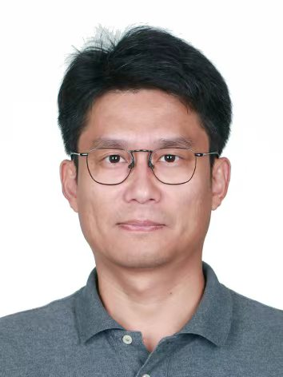

## About Me

Welcome! I am QianFeng Shen. With more than a decade of experience in the pulp and paper engineering EPC sector, he has led and managed a number of major engineering projects in China and overseas. His professional experience spans the full project lifecycle, including project management, engineering coordination, site execution, technological innovation, and digital transformation. His professional capabilities and achievements have been widely recognized by clients, partners, and project stakeholders.

From 2007 to 2011, he participated throughout the entire lifecycle of China Haisum Engineering Co., Ltd.’s first overseas EPC project — the An Hoa Pulp and Paper Mill in Vietnam, with an annual pulp production capacity of 130,000 tonnes. His responsibilities covered project planning, bidding and cost estimation, engineering design, subcontracting and procurement, site installation management, commissioning, and other key stages. The project received a number of prestigious national and industry awards, including the Silver Award of the National Quality Engineering Award, First Prize for Excellent Engineering Design in China’s Light Industry, and Third Prize for Outstanding Engineering Design Achievements in China, and became one of China Haisum’s benchmark overseas engineering projects.

He subsequently served as Design Manager, Project Manager, and Site Construction Management Lead for a number of major projects, including the SKIC PM16 EPC Project in Thailand, Asia Symbol projects, and Huafeng Paper projects. In these roles, he was responsible for coordinating plant-wide technical standards, detailed engineering design, subcontractor tendering, equipment procurement, and site management. Several of these projects received Excellent Engineering Design Awards in China’s light industry. During this period, he also led the development of an innovative flange for pulp and paper applications designed to prevent pulp buildup, for which a Chinese utility model patent was granted.

From 2018 to 2023, he was responsible for the overall management and site coordination of several overseas pulp and paper projects, leading his teams to receive the company’s Outstanding Project Team awards.

Beginning in 2019, he became involved in the development of multiple digital transformation initiatives within China Haisum. In 2023, he transferred to the company’s headquarters digitalization department, where he focused full-time on project management, the digital upgrading of process engineering disciplines, and the research and development of related digital products. In 2025, he was appointed Operations Director of the Intelligent Manufacturing Business Division. Drawing on his extensive frontline engineering and project management experience, he has contributed to the implementation and development of China Haisum’s intelligent manufacturing and digital businesses, while promoting the digital and intelligent upgrading of traditional process technologies and management practices. Projects that he has led or participated in have resulted in multiple intellectual property applications and have received a First Prize at the Shanghai municipal level and a Second Prize at the Yangtze River Delta regional level.

